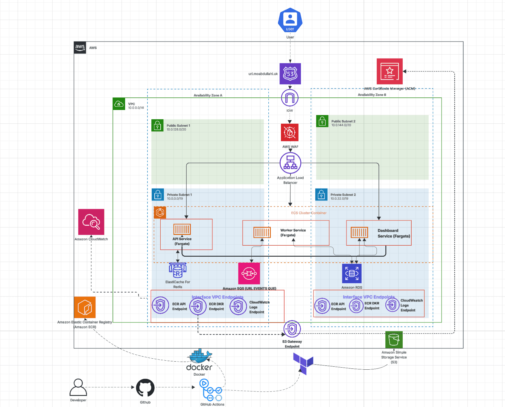
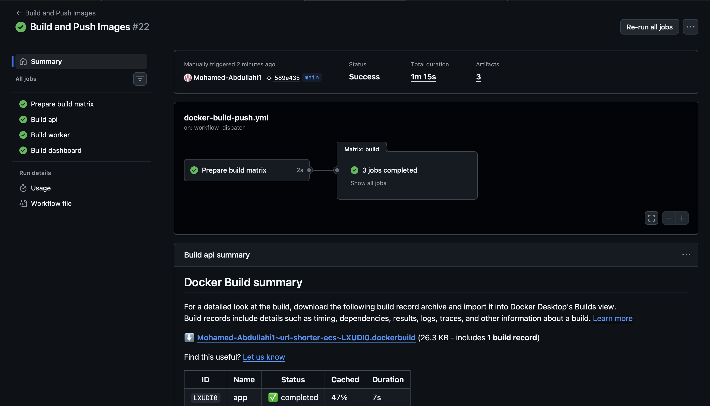
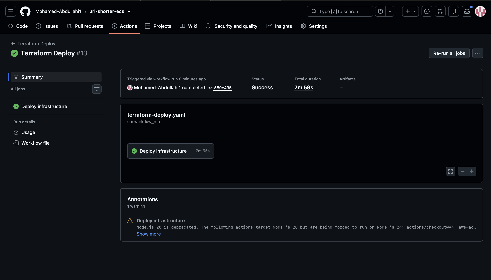
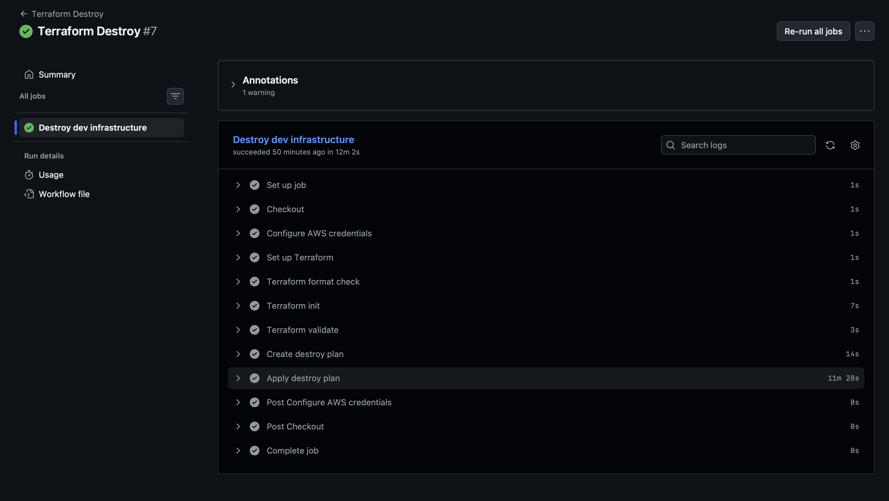
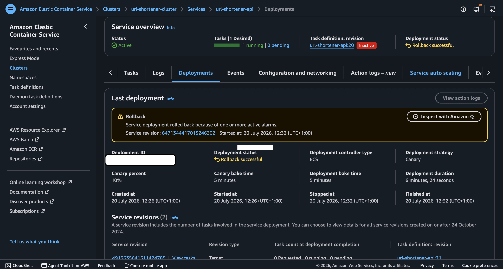
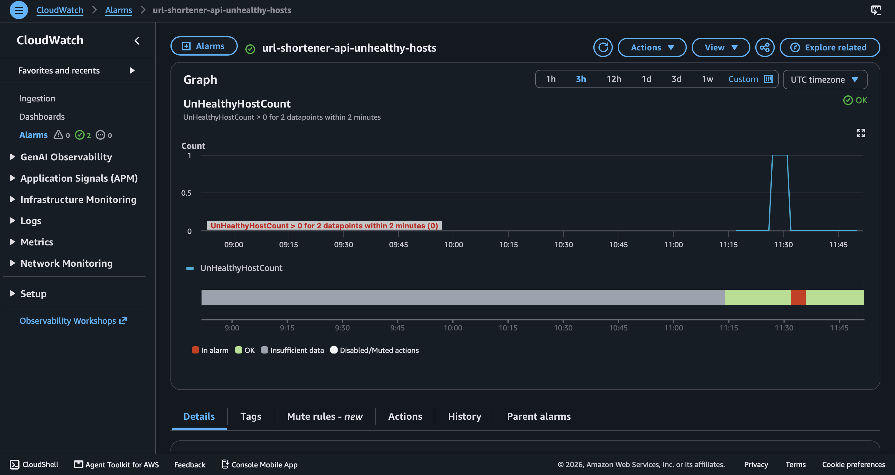

<h1 align="center"># ECS Blue/Green Deployment Platform</h1>

<div align="center">


</div>

## Overview

Production-grade URL shortening platform running on AWS ECS Fargate, designed around secure infrastructure automation, automated deployments and resilient release strategies.

Infrastructure is provisioned entirely through Terraform across a custom multi-AZ VPC, with all application workloads running in private subnets behind an Application Load Balancer. GitHub Actions authenticates to AWS using OpenID Connect (OIDC), eliminating the need for long-lived AWS credentials, while Amazon ECS delivers application updates using native canary deployments with automatic CloudWatch alarm-based rollback.

The platform consists of four independent services: a React frontend, a FastAPI API responsible for URL shortening and redirects, a background worker that processes asynchronous click events from Amazon SQS, and an analytics dashboard. Amazon RDS for PostgreSQL provides persistent storage, while Amazon ElastiCache for Redis improves application performance through caching.

HTTPS is provided through AWS Certificate Manager (ACM), with AWS WAF protecting the public entry point. Security is enforced through least-privilege IAM roles, security group isolation between services, and non-root container images, ensuring the platform follows AWS security best practices while remaining fully reproducible through Infrastructure as Code.

## Live Application

The platform is live and accessible over HTTPS at [url.moabdullahi.uk](https://url.moabdullahi.uk).

## Live Demo

[View Platform Demo](https://github.com/user-attachments/assets/e66002aa-8e5c-4306-8069-75e1b45fe22f)

## Key Outcomes

- Built a secure, multi-service URL shortening platform on Amazon ECS Fargate, consisting of independent API, Worker and Dashboard services deployed within a custom multi-AZ VPC.

- Provisioned the entire AWS infrastructure using Terraform, including VPC networking, ECS, RDS PostgreSQL, ElastiCache Redis, Amazon SQS, IAM, AWS WAF, ACM, and Application Load Balancer resources through reusable modules.

- Implemented a fully automated CI/CD pipeline using GitHub Actions with OpenID Connect (OIDC), eliminating long-lived AWS credentials while automating container builds, vulnerability scanning, infrastructure deployment, and application releases.

- Deployed application updates using native Amazon ECS canary deployments, progressively shifting production traffic to new task revisions before promoting them to full production.

- Configured automatic deployment rollback using Amazon CloudWatch alarms, enabling failed deployments to revert to the previous healthy task revision without manual intervention.

- Designed the platform following AWS security best practices using private subnets, least privilege IAM roles, AWS WAF, HTTPS with AWS Certificate Manager (ACM), non-root container images, and automated vulnerability scanning with Trivy.

- Optimised infrastructure costs by replacing NAT Gateways with VPC Endpoints, reducing container image sizes through multi-stage Docker builds, and provisioning infrastructure on demand using Terraform.

---
## Architecture

The platform is deployed within a custom multi-Availability Zone Amazon VPC, with all application workloads running in private subnets behind an internet-facing Application Load Balancer. HTTPS traffic is protected by AWS WAF and terminated using AWS Certificate Manager before being forwarded to Amazon ECS Fargate services.

The platform consists of four independent services: a React frontend, an API responsible for URL shortening and redirects, a worker service that processes asynchronous tasks from Amazon SQS, and a dashboard service for application management. Amazon RDS for PostgreSQL provides persistent storage, while Amazon ElastiCache for Redis improves application performance through caching.
To reduce operational overhead and improve security, the infrastructure is provisioned entirely with Terraform and deployed through GitHub Actions using OpenID Connect (OIDC). Native Amazon ECS canary deployments combined with Amazon CloudWatch deployment alarms provide automatic rollback when unhealthy task revisions are detected.

<p align="center">
  
</p>

---
## Design Decisions & Trade-offs

### VPC Endpoints over NAT Gateways

Interface and Gateway VPC Endpoints were used instead of NAT Gateways, allowing private workloads to communicate with AWS services without traversing the public internet. This reduced networking costs while improving the security posture by keeping traffic within the AWS network.

### Native Amazon ECS Canary Deployments

Native Amazon ECS canary deployments were chosen over all-at-once deployments to reduce the risk of introducing faulty application versions into production. New task revisions receive 10% of production traffic for a 5-minute bake period while Amazon CloudWatch deployment alarms continuously monitor application health. If an unhealthy deployment is detected, Amazon ECS automatically rolls back to the previous healthy task revision without manual intervention.

### Amazon S3 for Remote Terraform State

Amazon S3 was chosen as the remote Terraform backend to provide durable, versioned, and centrally managed state storage. Storing the Terraform state remotely enables consistent infrastructure management across environments while allowing the infrastructure to be recreated reliably.

### OpenID Connect (OIDC) over Long-Lived Credentials

GitHub Actions authenticates to AWS using OpenID Connect (OIDC) instead of long-lived IAM access keys. This removes the need to store AWS credentials in GitHub Secrets while providing short-lived credentials for each workflow execution.

---

## Key Features

### Platform

- Four independent microservices running on Amazon ECS Fargate
- Infrastructure provisioned entirely with Terraform
- Multi-AZ deployment across private subnets
- HTTPS using AWS Certificate Manager (ACM)

### Deployment

- GitHub Actions CI/CD pipelines
- OpenID Connect (OIDC) authentication to AWS
- Multi-stage Docker builds
- Native Amazon ECS canary deployments
- Automatic CloudWatch alarm-based rollback

### Networking

- Custom Amazon VPC spanning two Availability Zones
- Internet-facing Application Load Balancer
- Private application workloads
- AWS WAF protection
- Security group isolation between services

### Data

- Amazon RDS PostgreSQL for persistent storage
- Amazon ElastiCache Redis for caching
- Amazon SQS for asynchronous event processing

### Security

- Least privilege IAM roles
- Non-root container images
- Vulnerability scanning with Trivy
- No long-lived AWS credentials

## Security

Security was considered throughout both the development lifecycle and platform architecture, following the principle of least privilege and AWS security best practices.

### Secure Development

The repository uses `pre-commit` hooks to improve the security of the codebase before changes are committed.

Security-focused checks include:

- **Gitleaks** to prevent secrets, API keys and credentials from being committed.
- **Terraform validation** to detect invalid infrastructure configurations before they reach the CI pipeline.
- **Merge conflict detection** to reduce the risk of unintentionally deploying unresolved code.

By enforcing these checks locally, potential security issues can be identified and resolved before code is pushed to GitHub.

### Platform Security

- GitHub Actions authenticates to AWS using OpenID Connect (OIDC), eliminating the need for long-lived IAM access keys.
- All application workloads run within private subnets, with only the Application Load Balancer exposed to the internet.
- Security groups restrict communication between services to only the traffic required.
- AWS WAF protects the application using managed rule groups and rate limiting.
- HTTPS is enforced using AWS Certificate Manager (ACM).
- ECS tasks use dedicated IAM roles with only the permissions required for each service.
- Docker images run as a non-root user to reduce the impact of container compromise.
- Container images are automatically scanned for known vulnerabilities using Trivy during the CI pipeline.

## Pipeline Execution

### Docker Build & Push

Builds container images for the API, Worker, and Dashboard services using a GitHub Actions matrix strategy, allowing all three images to be built in parallel from a single workflow. Each image is scanned for known vulnerabilities using Trivy before being pushed to Amazon ECR with an immutable image tag.



---

### Terraform Apply

Authenticates to AWS using OpenID Connect (OIDC), generates a Terraform execution plan, and provisions or updates the AWS infrastructure. Where new container image tags are available, Terraform updates the ECS task definitions and services, triggering a native Amazon ECS canary deployment.



---

### Terraform Destroy

Authenticates to AWS using OpenID Connect (OIDC) before safely destroying all Terraform-managed infrastructure, allowing the environment to be cleaned up when no longer required.



## Canary Deployments & Automatic Rollback

Application updates are deployed using native Amazon ECS canary deployments, allowing new task revisions to be validated using a small percentage of production traffic before a full rollout.

Rather than replacing all running tasks simultaneously, ECS gradually shifts traffic to the new task revision while continuously monitoring deployment health using Amazon CloudWatch deployment alarms.

### Deployment Strategy

- Native Amazon ECS canary deployments
- 10% initial traffic shift
- 5-minute bake period before promotion
- CloudWatch deployment alarms
- Automatic rollback on deployment failure

### Rollback Validation

To verify the rollback mechanism, the application's `/healthz` endpoint was intentionally modified to return an unhealthy response during deployment.

The deployment entered the canary phase, where 10% of production traffic was directed to the new task revision for a 5-minute bake period. During this time, the Application Load Balancer health checks failed, causing the associated CloudWatch deployment alarm to enter the `ALARM` state.

Amazon ECS automatically cancelled the deployment, redirected production traffic to the previous healthy task revision, and completed the rollback without requiring manual intervention.

This validated both the deployment alarm configuration and the automatic rollback behaviour.



---

### CloudWatch Deployment Alarm

The deployment alarm continuously monitored the health of the Application Load Balancer target group throughout the canary deployment. When the unhealthy host count exceeded the configured threshold, the alarm entered the `ALARM` state, signalling Amazon ECS to roll back the deployment automatically.



## Project Structure

```text
.
├── app/
│   ├── src/
│   └── tests/
│
├── services/
│   ├── dashboard/
│   └── worker/
│
├── infra/
│   ├── bootstrap/
│   ├── envs/
│   └── modules/
│
├── .github/
│   └── workflows/
│
├── docker-compose.yml
├── README.md
└── docs/
```

## Local Development

### Run Locally

Clone the repository:

```bash
git clone https://github.com/Mohamed-Abdullahi1/ecs-blue-green-platform.git
cd ecs-blue-green-platform
```

Start the local development environment:

```bash
docker compose up --build
```

Stop the environment:

```bash
docker compose down
```

---

### Deploy to AWS

#### 1. Bootstrap the Terraform Backend

Provision the remote Terraform backend used to store state.

```bash
terraform -chdir=infra/bootstrap init
terraform -chdir=infra/bootstrap apply
```

---

#### 2. Deploy the Platform

Initialise Terraform:

```bash
terraform -chdir=infra/envs/dev init
```

Review the execution plan:

```bash
terraform -chdir=infra/envs/dev plan
```

Deploy the infrastructure:

```bash
terraform -chdir=infra/envs/dev apply
```

---

#### 3. Destroy the Platform

Remove all provisioned infrastructure when it is no longer required:

```bash
terraform -chdir=infra/envs/dev destroy
```
